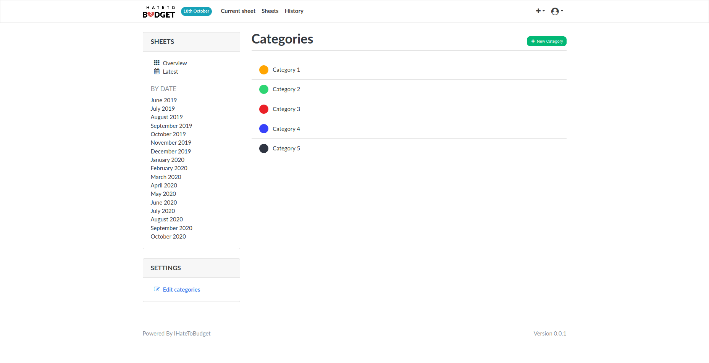
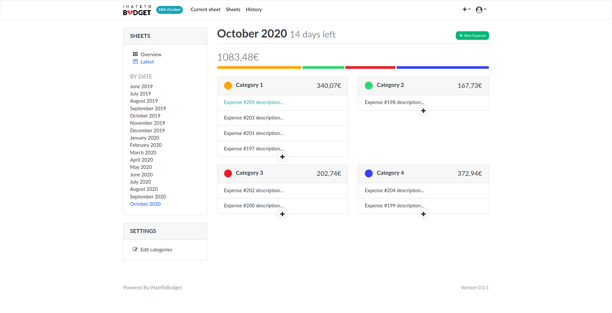
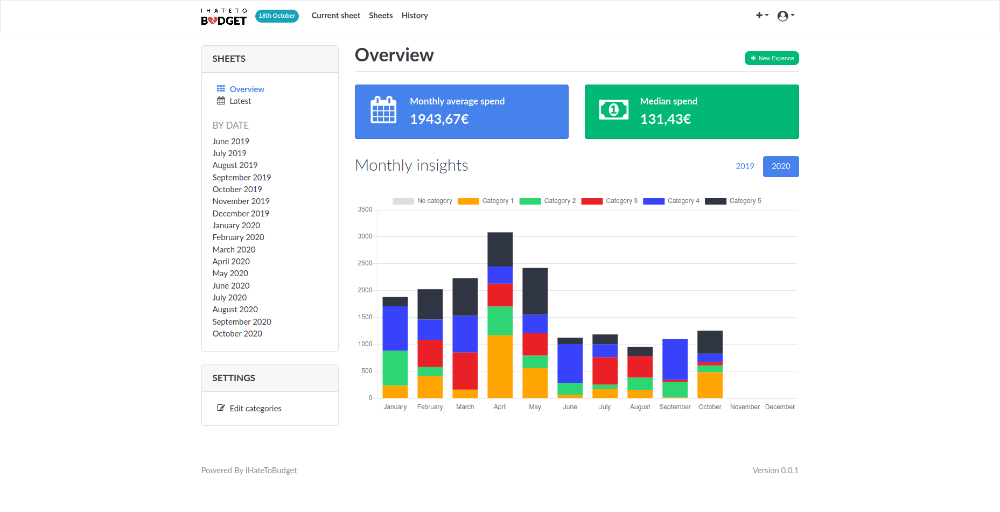
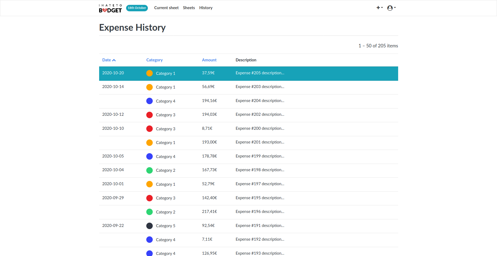

__IHateToBudget is now archived. See [#26](https://github.com/bminusl/ihatetobudget/issues/26).__

---

<p align="center">
  <a href="https://github.com/bminusl/ihatetobudget/">
    
  </a>
</p>


<h3 align="center">IHateToBudget</h3>

<p align="center">
  
  
  
  
  
  
</p>

<p align="center">
  A simple web app to understand and control your expenses.
  <br>
  Designed to be self-hosted.
  <br>
  <em>Inspired by <a href="https://github.com/inoda/ontrack">OnTrack</a>.</em>
</p>

## Table of contents
* [About](#About)
* [Features](#Features)
* [Installation & Configuration](#installation--configuration)
  * [Docker method](#docker-method)
* [Updating](#updating)
  * [Docker method](#docker-method-1)
* [License](#license)
* [Contributing](#contributing)
* [Developer documentation](#developer-documentation)
  * [The development environment](#the-development-environment)
    * [Set up](#set-up)
    * [Usage](#usage)
  * [Code quality](#code-quality)
  * [Testing](#testing)


## About

[](https://github.com/awesome-selfhosted/awesome-selfhosted)

It is important to control your budget and know where your money goes. I've tried lots of different apps and methods, but none have really convinced me. So I designed and developed IHateToBudget, a simple and efficient application that meets my needs.

And it's also available for you.

## Features

A basic authorization system exists but this application is not intended to be hosted on a public network (yet?). It is designed to be self-hosted locally (e.g. on a Raspberry Pi) and used by a few users within the same household.

#### 1. Categories

Define categories, and their color.



#### 2. Sheet

Add dated and categorized expenses. They are automatically grouped by month (i.e. sheet).



#### 3. Overview

Analyze the overall statistics.



#### 4. History

Explore and filter all expenses.



## Installation & Configuration

### Docker method

**The following instructions are guidelines. You're free to adapt these to your needs.**

1. Install [Docker](https://www.docker.com/) and [docker-compose](https://docs.docker.com/compose/), if you haven't already.

2. Clone the repository:

   ```bash
   git clone https://github.com/bminusl/ihatetobudget.git
   cd ihatetobudget
   ```

3. Create a copy of:

   * `docker-compose.yml.example` as `docker-compose.yml`
   * `docker-compose.env.example` as `docker-compose.env`
   * `Caddyfile.example` as `Caddyfile`

   ```bash
   cp docker-compose.yml.example docker-compose.yml
   cp docker-compose.env.example docker-compose.env
   cp Caddyfile.example Caddyfile
   ```

   Note: Making copies ensures that you can `git pull` (or equivalent) to receive updates without risking merge conflicts with upstream changes.

4. Edit `docker-compose.env` and adapt the following environment variables:

   * `DJANGO_SECRET_KEY`: This is the secret key used by Django.

      See [https://docs.djangoproject.com/en/3.1/ref/settings/#std:setting-SECRET_KEY](https://docs.djangoproject.com/en/3.1/ref/settings/#std:setting-SECRET_KEY) for more information.

   **Currency formatting**

   In IHateToBudget, money is represented by positive decimals of the form "xxxxxxxx.yy". The user is free to change the formatting to use the currency of their choice, by setting the following environment variables:

   * `CURRENCY_GROUP_SEPARATOR`: A single character which separates the whole number into groups of 3 digits.<sup>1</sup>
   * `CURRENCY_DECIMAL_SEPARATOR`: A single character that separates the whole part from the decimal part.<sup>1</sup>
   * `CURRENCY_PREFIX`: A string placed in front of the number.<sup>1</sup>
   * `CURRENCY_SUFFIX`: A string placed behind the number.<sup>1</sup>

   By default, it formats money as French euros. For instance, here's how to format as US dollars:

   ```
   CURRENCY_GROUP_SEPARATOR=,
   CURRENCY_DECIMAL_SEPARATOR=.
   CURRENCY_PREFIX=$
   CURRENCY_SUFFIX=
   ```

   ---

   <sup>1</sup>: Note: If it contains spaces, make sure to use [non-breaking spaces](https://en.wikipedia.org/wiki/Non-breaking_space). This is simply to prevent visual "glitches".

5. Run `docker-compose up -d`. This will build the main image, and create and start the necessary containers.

6. Start cron inside the container:

   ```bash
   docker-compose exec ihatetobudget service cron start
   ```

7. To be able to login, you will need a (super) user. To create it, execute the following commands:

   ```bash
   docker-compose run --rm ihatetobudget pipenv run python manage.py migrate
   docker-compose run --rm ihatetobudget pipenv run python manage.py createsuperuser
   ```

   This will prompt you to set a username, an optional e-mail address and finally a password.

8. You should now be able to visit your [IHateToBudget instance](http://127.0.0.1:80) at `http://127.0.0.1:80`. You can login with the username and password you just created.

## Updating

### Docker method

**The following instructions are guidelines. You're free to adapt these to your needs.**

1. Navigate to the root of the repository.

2. Run `docker-compose down -v`. This will stop all containers.

   Note: Volumes are also removed (`-v`), see [why](https://github.com/bminusl/ihatetobudget/commit/d893f01e223909df80f80d9187c355091b18c6e8).

3. **Create a backup of the database**—just in case—, e.g. run `cp db.sqlite3 db.sqlite3.bak`.

4. Upgrade the codebase to the desired revision, e.g. run `git pull`.

5. Rebuild the image:

   ```bash
   docker-compose build
   ```

6. Migrate the database:

   ```bash
   docker-compose run --rm ihatetobudget pipenv run python manage.py migrate
   ```

   This action will synchronize the database state with the current set of models and migrations.

7. Run `docker-compose up -d`. This will create and start the necessary containers.

8. Start cron inside the container:

   ```bash
   docker-compose exec ihatetobudget service cron start
   ```


## License

Distributed under the GPLv3 License. See `COPYING` for more information.


## Contributing

I maintain this project primarily for my own use. If you can think of any relevant changes that should be incorporated into the code, you can contribute by opening an issue or submitting a pull request.

See the [Developer documentation](#developer-documentation) section below for more information.

## Developer documentation

**_This section is WIP_**

### The development environment

#### Set up

1. Install [Pipenv](https://pypi.org/project/pipenv/), if you haven't already.

   Pipenv is used to manage dependencies and the virtual environment.
   Note: IHateToBudget currently targets **Python 3.8**, so **make sure it is installed too**.

2. Set up the virtual environment by executing the following command:

   ```bash
   pipenv install --dev
   ```

   This action will install both develop and default packages.

#### Usage

When you start a new development session, run the following command:

```bash
pipenv shell
```

This action spawns a shell within the virtualenv.


---

**You should now be able to work.**

Since IHateToBudget is primarily a Django project, you should read [Django's documentation](https://docs.djangoproject.com/en/3.1/) if you are not familiar with it already.

### Code quality

[`pre-commit`](https://pypi.org/project/pre-commit/) hooks are used to keep the code clean, namely:
* [`black`](https://pypi.org/project/black/)
* [`flake8`](https://pypi.org/project/flake8/)
* [`isort`](https://pypi.org/project/isort/)

Execute the following command to run pre-commit against all files:

```bash
pre-commit run --all-files
```

### Testing

* To run tests, execute the following command:

  ```bash
  python manage.py test
  ```

* Alternatively, [`coverage`](https://pypi.org/project/coverage/) can be used to measure code coverage:

  ```bash
  coverage run --source='.' manage.py test
  ```
